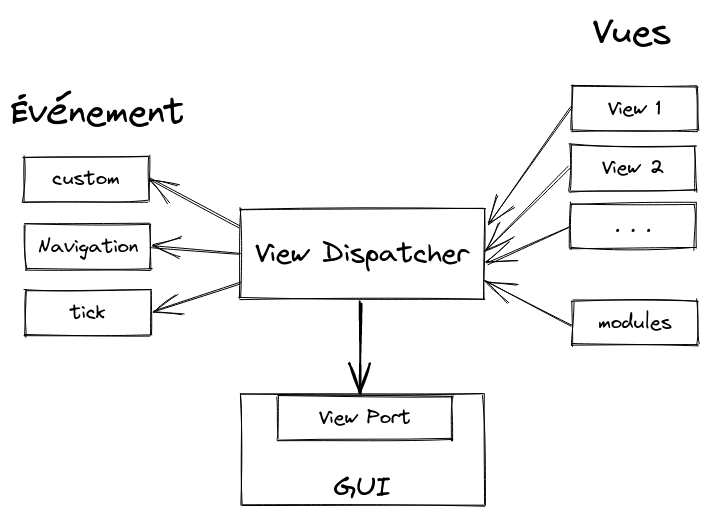

# Flipper Zero - Test des vues
## But
Approfondir le service **GUI** en découvrant les vues (*views*) et la méthode d'attachements avec **view_dispatcher**.

## Présentation
**View_dispatcher** est une sur couche à la triplette **GUI**, **cavnas** et **view_port**. L'environment d'avant était un peu austère, il n'y avait que deux fonctions de rappel. Une pour gérer l'affichage et l'autre pour traiter les entrées.

Maintenant avec **View_dispatcher**, il a un système de vues (*views*) pour simplifier la composition à afficher. Il en gère et définit quand les afficher (il les dispatche). Il simplifie aussi toute la gestion des événements entrant et facilite la navigation entre les différentes vues.

### Première étape pour afficher et quitter.
Comme d'habitude, il faut commencer par allouer les ressources. La première partie concernant l'interface graphique GUI a été abordée dans la [partie 1](https://github.com/FlipperFrenchCommunity/BoxMover), il faut donc se référer à celle-ci pour plus d'information.

Ici, view_port est donc remplacé par view_dispatcher. Un fois sa structure d'état allouée il faudra aussi l'attacher à l'interface graphique. Il n'y a plus besoin d'allouer une file de messages (queue) provenant de **Furi**. Une file peut être directement définie en interne avec la fonction ***view_dispatcher_enable_queue()***. Cette fonction se charge de la créer avec **Furi**. Cette file est aussi utilisée pour transmettre les événements.

La première vue peut être créée en commençant par lui allouer les ressource. Comme pour view_port, il faut lui passer une fonction de rappel pour modifier l'affichage avec la fonction ***view_set_draw_callback()*** et une autre pour gérer les événements en entrées avec ***view_set_input_callback()***. Ces deux fonction font appel à leur fonction respective: ***view_port_draw_callback_set()*** et ***view_port_input_callback_set()***.

Dans la fonction de rappel coder l'affichage, une simple fonction ***canvas_draw_str()*** provenant de **canvas** affichera une chaîne de caractères.

La détection des entrées de l'utilisateur est simplifiée. En utilisant la fonction ***view_set_previous_callback()***, une fonction de rappel sera définit pour afficher la prochaine vue lorsque la touche retour sera pressée. Une valeur de retour contant la prochaine vu est retournée. Ici c'est la constante **VIEW_NONE** aui est retournée et elle signale au dispatcher de se terminer proprement. Avec cette solution nous n'avons pas besoin d'utilise de fonction de rappel pour les événements en entrée vu que nous pouvons quitter le programme.

Maintenant, que la vue est crée, il est possible de l'ajouter au dispatcher avec ***view_dispatcher_add_view()*** et de lui dire de l'afficher avec ***view_dispatcher_switch_to_view()***.

Il ne reste plus qu'a démarrer le dispatcher dans la fonction principale avec ***view_dispatcher_run()***

Bien sur, il ne faut pas oublier de libérer les ressources à la fin du programme pour éviter les fuites de mémoires.